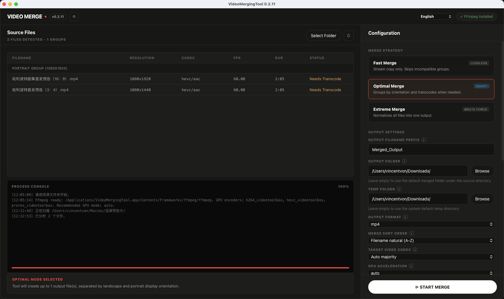

<p align="center">
  
</p>

<h1 align="center">VideoMergingTool</h1>

<p align="center">
  A simple desktop app for merging videos locally.
</p>

<p align="center">
  <a href="README.md">简体中文</a>
  ·
  <a href="README.en.md">English</a>
  ·
  <a href="https://github.com/yibailiu/VideoMergingTool/releases">Download</a>
</p>

---

VideoMergingTool helps you combine many video clips into longer videos without uploading your files anywhere. It is designed for everyday desktop use: install the app, choose a folder, review the detected videos, pick a merge mode, and start.

The packaged Windows and macOS apps include FFmpeg and FFprobe, so normal users do not need to install FFmpeg manually.

## What It Does
<p align="center">
  
</p>

- Finds common video files in a folder, including `mp4`, `mkv`, `mov`, `avi`, `ts`, `m4v`, `flv`, and `webm`
- Shows useful details such as duration, resolution, codec, FPS, and status
- Merges videos in a predictable order, with common sorting options
- Supports landscape and portrait videos
- Keeps the original picture visible when resizing is needed; it pads instead of cropping
- Lets you choose output folder, temp folder, language, merge mode, GPU option, and whether to keep temp files
- Shows process logs and progress inside the app window
- Runs locally in a desktop window, without opening an external browser

## Download

Go to the [Releases page](https://github.com/yibailiu/VideoMergingTool/releases) and download the package for your system.

| System | File to download | How to install |
| --- | --- | --- |
| Windows | `VideoMergingTool-Setup.exe` | Run the installer, then open the app from Start Menu or the desktop shortcut. |
| macOS Apple Silicon | `VideoMergingTool-macos-apple-silicon.dmg` | Open the DMG and drag the app into Applications. |
| macOS Intel | `VideoMergingTool-macos-intel.dmg` | Open the DMG and drag the app into Applications. |
| Linux | `VideoMergingTool` | Download the executable and run it directly. |

## Quick Start

1. Open VideoMergingTool.
2. Click **Select Folder** and choose the folder that contains your videos.
3. Confirm the detected files and merge order.
4. Choose a merge mode:
   - **Fast Merge** for compatible files when you want the fastest lossless merge.
   - **Optimal Merge** for mixed landscape or portrait files in most normal cases.
   - **Extreme Merge** when everything should become one final video even if files differ a lot.
5. Choose an output folder if you do not want to use the default.
6. Click **Start Merge**.

## Which Merge Mode Should I Use?

| Mode | Best for | Notes |
| --- | --- | --- |
| Fast Merge | Clips from the same camera or same export settings | Fastest and lossless, but incompatible files may be skipped or split into groups. |
| Optimal Merge | Everyday mixed folders | Balances quality, compatibility, and speed. Landscape and portrait videos may be handled separately. |
| Extreme Merge | Turning many different files into one output | Most compatible option, but usually takes longer because videos are normalized. |

If you are not sure, start with **Optimal Merge**.

## Settings Reference

Most users can use the desktop controls without typing any command. The table below explains what each important option means. The CLI option is included for users who automate the app.

| App setting | CLI option | What it means |
| --- | --- | --- |
| Source Folder | `input_dir` | The folder that contains the videos you want to merge. |
| Merge Mode | `--mode fast\|optimal\|extreme` | Chooses the merge strategy. Use `optimal` when unsure. |
| Output Folder | `--output-dir PATH` | Where merged videos are saved. If left as default, the app uses a `merged` folder under the source folder. |
| Output Format | `--output-format mp4\|mkv\|mov\|avi\|ts\|webm` | The container format of the merged output. `mp4` is the safest default for most users. |
| Output Filename Prefix | `--name TEXT` | Custom output filename without the file extension. |
| Sort Order | `--sort-by VALUE` | Controls the merge order. Natural name order is best for files like `video1`, `video2`, `video10`. |
| Recursive Scan | `--recursive` / `--no-recursive` | Includes or excludes videos inside subfolders. |
| Overwrite | `--overwrite` | Allows the app to replace existing output files with the same name. |
| Keep Temp Files | `--keep-temp` | Keeps intermediate files after merging. Useful for troubleshooting, but it uses more disk space. |
| Temp Folder | `--temp-dir PATH` | Where temporary processing files are stored. Choose a fast disk with enough free space for large batches. |
| Dry Run | `--dry-run` | Shows the planned work without actually running FFmpeg. |
| GPU Acceleration | `--gpu off\|auto\|nvenc\|qsv\|amf\|videotoolbox` | Uses hardware encoding when available. `auto` is convenient; `off` is safest for compatibility. |
| Target Video Codec | `--video-codec TEXT` | Overrides the output video codec. Leave default unless you know which codec you need. |
| Target Audio Codec | `--audio-codec TEXT` | Overrides the output audio codec. Leave default unless your playback device requires a specific codec. |
| Quality | `--crf 0-51` | Controls transcode quality. Lower values usually mean better quality and larger files. Default is `20`. |
| Encoder Preset | `--preset TEXT` | Controls encoding speed and compression. `medium` is the default balance. |
| FPS Policy | `--fps-policy majority\|max\|min` | Chooses the target frame rate for transcode modes. `majority` is usually best. |
| Padding Color | `--pad-color TEXT` | Color used when the app needs to add borders instead of cropping the image. Default is `black`. |
| FFmpeg Path | `--ffmpeg-path PATH` | Optional manual path to `ffmpeg`. Packaged apps normally use the bundled copy. |
| FFprobe Path | `--ffprobe-path PATH` | Optional manual path to `ffprobe`. Packaged apps normally use the bundled copy. |
| Auto Download Deps | `--auto-download-deps` / `--no-auto-download-deps` | Source runs can download FFmpeg when missing. Packaged apps already include it. |

Sort order values:

| Value | Order |
| --- | --- |
| `name-natural-asc` | Natural filename order, A to Z. Example: `1, 2, 10`. |
| `name-natural-desc` | Natural filename order, Z to A. |
| `name-asc` | Plain filename order, A to Z. Example: `1, 10, 2`. |
| `name-desc` | Plain filename order, Z to A. |
| `modified-asc` | Oldest modified file first. |
| `modified-desc` | Newest modified file first. |
| `size-asc` | Smallest file first. |
| `size-desc` | Largest file first. |

## Privacy

VideoMergingTool processes your videos on your own computer. It does not upload your video files to a server.

When running from source, the tool may download FFmpeg if no local FFmpeg is available. Packaged desktop builds already include FFmpeg.

## System Security Prompts

Unsigned builds may trigger Windows SmartScreen or macOS Gatekeeper warnings. These warnings are about publisher signing status, not about the app uploading files.


## Tips

- Use a folder with enough free disk space, especially for **Optimal Merge** or **Extreme Merge**.
- If a merge is stopped manually and temp files are not being kept, the app cleans up the temp files created by that run.
- For large batches, keep the app open until the console shows that the merge has finished.
- If the output looks different from the input, try another merge mode or disable GPU acceleration.

## Advanced Users

The desktop app is the recommended way to use VideoMergingTool. A command-line interface is also available for automation:

```bash
VideoMergingTool merge /path/to/videos --mode optimal
```

Source runs are intended for testing and development:

```bash
python main.py gui
python main.py merge /path/to/videos --mode optimal
```
