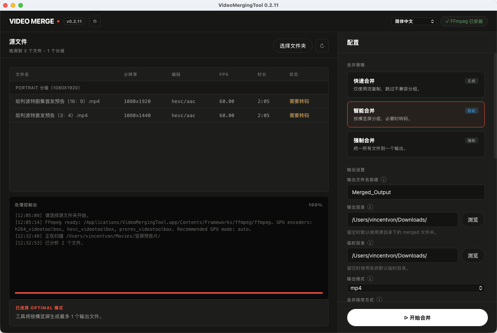

<p align="center">
  
</p>

<h1 align="center">VideoMergingTool</h1>

<p align="center">
  一个本地运行的桌面视频合并工具。
</p>

<p align="center">
  <a href="README.md">简体中文</a>
  ·
  <a href="README.en.md">English</a>
  ·
  <a href="https://github.com/yibailiu/VideoMergingTool/releases">下载</a>
</p>

---

VideoMergingTool 用来把一个文件夹里的多个视频批量合并成更长的视频。它面向普通桌面用户设计：安装应用，选择视频文件夹，确认识别结果，选择合并模式，然后开始合并。

Windows 和 macOS 安装包已经内置 FFmpeg / FFprobe，普通用户不需要手动安装 FFmpeg，也不需要配置环境变量。

## 它能做什么
<p align="center">
  
</p>

- 扫描文件夹中的常见视频格式，包括 `mp4`、`mkv`、`mov`、`avi`、`ts`、`m4v`、`flv`、`webm`
- 显示视频时长、分辨率、编码、帧率和处理状态
- 按常见规则排序合并，避免 `1, 10, 11, 2` 这类顺序问题
- 支持横屏和竖屏视频
- 需要统一画面尺寸时，会补边而不是裁切，尽量保留完整画面
- 可设置输出目录、临时目录、界面语言、合并模式、GPU 选项、是否保留临时文件
- 在应用窗口内显示处理日志和进度
- 作为桌面应用运行，不依赖浏览器打开

## 下载

前往 [Releases 页面](https://github.com/yibailiu/VideoMergingTool/releases) 下载对应系统的安装包。

| 系统 | 下载文件 | 安装方式 |
| --- | --- | --- |
| Windows | `VideoMergingTool-Setup.exe` | 运行安装包，然后从开始菜单或桌面图标打开。 |
| macOS Apple 芯片 | `VideoMergingTool-macos-apple-silicon.dmg` | 打开 DMG，将应用拖入“应用程序”。 |
| macOS Intel | `VideoMergingTool-macos-intel.dmg` | 打开 DMG，将应用拖入“应用程序”。 |
| Linux | `VideoMergingTool` | 下载可执行文件后直接运行。 |

## 快速开始

1. 打开 VideoMergingTool。
2. 点击 **Select Folder / 选择文件夹**，选择包含视频的文件夹。
3. 等待应用识别视频，并检查文件顺序。
4. 选择合并模式：
   - **Fast Merge**：适合同一设备、同一参数导出的视频，速度最快，尽量无损。
   - **Optimal Merge**：适合大多数日常场景，兼顾速度、兼容性和画面方向。
   - **Extreme Merge**：适合差异很大的视频都要合并成一个结果的场景。
5. 如有需要，选择输出目录。
6. 点击 **Start Merge / 开始合并**。

## 应该选择哪种合并模式？

| 模式 | 适合场景 | 说明 |
| --- | --- | --- |
| Fast Merge | 同一相机、同一软件导出、参数基本一致的视频 | 最快，尽量无损；如果文件参数不兼容，可能会分组或跳过。 |
| Optimal Merge | 大多数普通文件夹 | 推荐默认使用，兼顾质量和兼容性；横屏和竖屏视频可能会分别处理。 |
| Extreme Merge | 想把差异很大的视频统一合并成一个文件 | 兼容性最强，但通常耗时更长，因为会统一视频参数。 |

不确定时，建议先使用 **Optimal Merge**。

## 设置和参数说明

大多数用户直接使用桌面界面即可，不需要输入命令。下面的表格解释常见设置的作用，同时列出对应的命令行参数，方便高级用户自动化使用。

| 界面设置 | 命令行参数 | 作用 |
| --- | --- | --- |
| Source Folder / 源文件夹 | `input_dir` | 包含待合并视频的文件夹。 |
| Merge Mode / 合并模式 | `--mode fast\|optimal\|extreme` | 选择合并策略。不确定时建议使用 `optimal`。 |
| Output Folder / 输出目录 | `--output-dir PATH` | 合并后视频的保存位置。默认会使用源文件夹下的 `merged` 文件夹。 |
| Output Format / 输出格式 | `--output-format mp4\|mkv\|mov\|avi\|ts\|webm` | 输出文件容器格式。大多数场景建议使用 `mp4`。 |
| Output Filename Prefix / 输出文件名前缀 | `--name TEXT` | 自定义输出文件名，不包含扩展名。 |
| Sort Order / 排序方式 | `--sort-by VALUE` | 控制合并顺序。文件名包含数字时，推荐使用自然排序。 |
| Recursive Scan / 递归扫描 | `--recursive` / `--no-recursive` | 是否扫描子文件夹中的视频。 |
| Overwrite / 覆盖输出 | `--overwrite` | 允许覆盖同名输出文件。 |
| Keep Temp Files / 保留临时文件 | `--keep-temp` | 合并后保留中间文件，便于排查问题，但会占用更多磁盘空间。 |
| Temp Folder / 临时目录 | `--temp-dir PATH` | 存放临时处理文件的位置。大批量合并时建议选择空间充足的高速磁盘。 |
| Dry Run / 试运行 | `--dry-run` | 只显示计划执行的操作，不真正调用 FFmpeg。 |
| GPU Acceleration / GPU 加速 | `--gpu off\|auto\|nvenc\|qsv\|amf\|videotoolbox` | 可用时使用硬件编码。`auto` 更方便，`off` 兼容性最好。 |
| Target Video Codec / 目标视频编码 | `--video-codec TEXT` | 指定输出视频编码。默认使用 H.264，WebM 输出默认 VP9。 |
| Target Audio Codec / 目标音频编码 | `--audio-codec TEXT` | 指定输出音频编码。普通用户建议保持默认。 |
| Quality / 质量 | `--crf 0-51` | 控制转码质量。数值越低通常质量越高、文件越大。默认值是 `20`。 |
| Encoder Preset / 编码预设 | `--preset TEXT` | 控制编码速度和压缩效率。默认 `medium` 兼顾速度和体积。 |
| FPS Policy / 帧率策略 | `--fps-policy majority\|max\|min` | 转码模式下选择目标帧率。通常使用 `majority`。 |
| Padding Color / 补边颜色 | `--pad-color TEXT` | 需要补边时使用的颜色，默认 `black`。 |
| FFmpeg Path / FFmpeg 路径 | `--ffmpeg-path PATH` | 手动指定 `ffmpeg` 路径。安装包通常会使用内置版本。 |
| FFprobe Path / FFprobe 路径 | `--ffprobe-path PATH` | 手动指定 `ffprobe` 路径。安装包通常会使用内置版本。 |
| Auto Download Deps / 自动下载依赖 | `--auto-download-deps` / `--no-auto-download-deps` | 源码运行时缺少 FFmpeg 可自动下载。安装包已内置，不需要下载。 |

排序方式可选值：

| 值 | 顺序 |
| --- | --- |
| `name-natural-asc` | 文件名自然升序。例如：`1, 2, 10`。 |
| `name-natural-desc` | 文件名自然降序。 |
| `name-asc` | 普通文件名升序。例如：`1, 10, 2`。 |
| `name-desc` | 普通文件名降序。 |
| `modified-asc` | 修改时间从旧到新。 |
| `modified-desc` | 修改时间从新到旧。 |
| `size-asc` | 文件大小从小到大。 |
| `size-desc` | 文件大小从大到小。 |

## 隐私说明

VideoMergingTool 在你的电脑本地处理视频，不会把视频文件上传到服务器。

源码运行时，如果本机没有 FFmpeg，工具可能会尝试下载 FFmpeg。桌面安装包已经内置 FFmpeg，不需要额外下载。

## 系统安全提示

未签名版本可能会触发 Windows SmartScreen 或 macOS Gatekeeper 提示。这类提示主要和发布者签名状态有关，并不代表应用会上传你的文件。


## 使用建议

- 合并大量视频前，请确认输出目录和临时目录有足够剩余空间。
- 如果手动停止合并任务，且没有开启保留临时文件，应用会清理本次生成的临时文件。
- 大批量合并时，请保持应用打开，直到控制台提示合并完成。
- 如果输出效果不符合预期，可以尝试切换合并模式，或关闭 GPU 加速后重试。

## 高级用户

普通用户推荐直接使用桌面界面。需要自动化时，也可以使用命令行：

```bash
VideoMergingTool merge /path/to/videos --mode optimal
```

源码运行主要用于测试和开发：

```bash
python main.py gui
python main.py merge /path/to/videos --mode optimal
```
